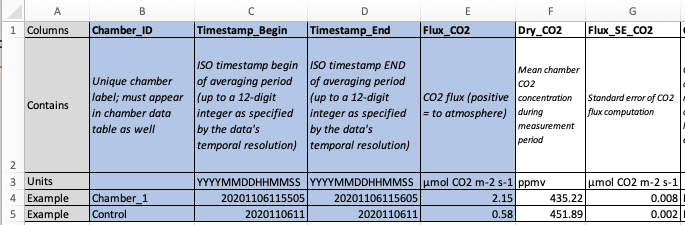
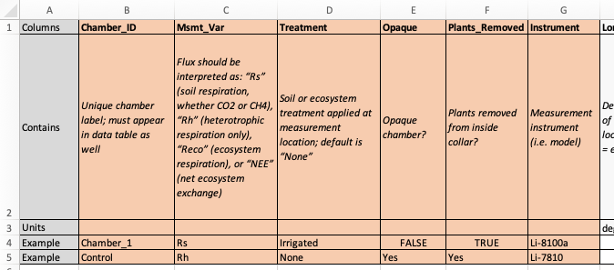

# Templates

Feel free to download and populate either version of the template as they both contain the same information. The `.xlsx` version simply highlights the required variables in blue and orange (as shown in the photos below), making them a bit easier to identify. **Please save your template as a CSV.**

Templates for the Soil Respiration Reporting Format can be downloaded [here](https://github.com/ess-dive-workspace/essdive-soil-respiration/tree/main/templates).

### Data Table Template

<figure><figcaption></figcaption></figure>

### **Chamber-level Metadata Template**

<figure><figcaption></figcaption></figure>
